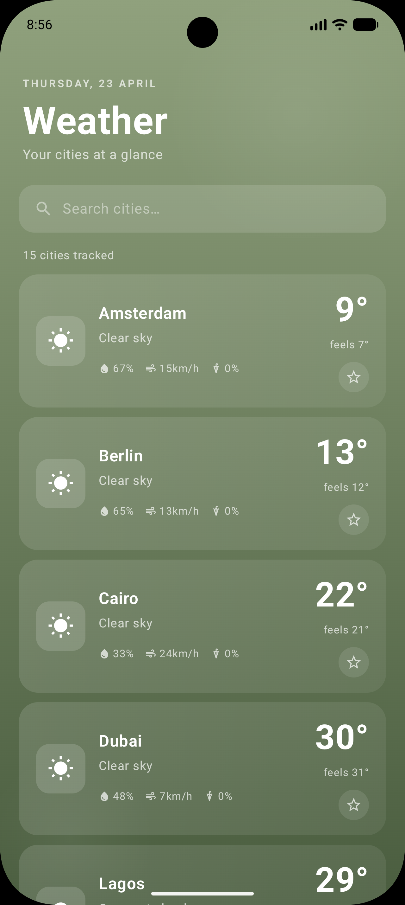
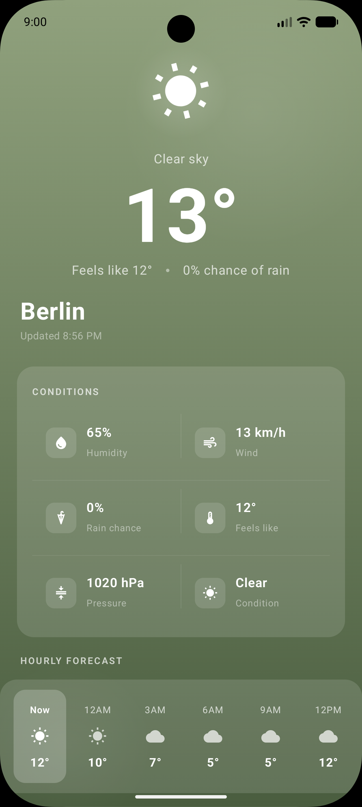

# Weather App

A modern, offline-first Android weather application built with Kotlin, Jetpack Compose, and Clean Architecture.

## 📸 Screenshots

<p align="center">
  
  
</p>

## 📥 Download

You can download the latest version of the app from the [Releases](https://github.com/techsultan/weather-app/releases) section of this repository.

1. Go to the [Releases page](https://github.com/techsultan/weather-app/releases).
2. Download the `app-release.apk` (or similar) from the latest release.
3. Install the APK on your Android device.

## Features

- **Current Weather:** Get real-time weather information for your current location or any city in the world.
- **Detailed Forecasts:** View hourly and daily forecasts with temperature, humidity, wind speed, and more.
- **City Search:** Search for any city worldwide using geocoding.
- **Offline Support:** Weather data is cached locally using Room, allowing you to view information even when offline.
- **Favorites:** Mark cities as favorites for quick access.
- **Dynamic UI:** Clean and responsive user interface built entirely with Jetpack Compose.
- **Background Updates:** Uses WorkManager to keep weather data fresh in the background.

## Tech Stack

- **Language:** [Kotlin](https://kotlinlang.org/)
- **UI:** [Jetpack Compose](https://developer.android.com/jetpack/compose)
- **Architecture:** MVVM (Model-View-ViewModel) with Clean Architecture principles.
- **Dependency Injection:** [Hilt](https://developer.android.com/training/dependency-injection/hilt-android)
- **Networking:** [Retrofit](https://square.github.io/retrofit/) & [OkHttp](https://square.github.io/okhttp/)
- **Local Database:** [Room](https://developer.android.com/training/data-storage/room)
- **Asynchronous Programming:** [Coroutines](https://kotlinlang.org/docs/coroutines-overview.html) & [Flow](https://kotlinlang.org/docs/flow.html)
- **Navigation:** [Navigation Compose](https://developer.android.com/jetpack/compose/navigation)
- **Background Processing:** [WorkManager](https://developer.android.com/topic/libraries/architecture/workmanager)
- **JSON Serialization:** [Kotlinx Serialization](https://github.com/Kotlin/kotlinx.serialization)
- **Testing:** JUnit, Mockito, Turbine, and Robolectric.

## Project Structure

The project follows a modular Clean Architecture approach:

- **`core`**: Contains shared components like network monitors and base classes.
- **`data`**: Handles data operations, including API calls (Retrofit), local database management (Room), and data mapping.
- **`domain`**: Contains business logic, use cases, and domain models (independent of framework).
- **`ui`**: UI layer containing Compose screens, ViewModels, and UI state management.
- **`di`**: Dependency injection modules.
- **`worker`**: Background tasks using WorkManager.

## Getting Started

1. **Clone the repository:**
   ```bash
   git clone https://github.com/techsultan/weather-app.git
   ```
2. **Open the project** in Android Studio (Ladybug or newer recommended).
3. **Get an API Key:** Sign up at [OpenWeatherMap](https://openweathermap.org/api) to get a free API key.
4. **Configure the API Key:** Add your API key and base url in the appropriate place (in `local.properties` file or directly in the code for development).
5. **Run the app** on an emulator or a physical device.

## Testing

The project includes unit tests for repositories, viewmodels, and data mappers. To run the tests, use:
```bash
./gradlew test
```

## License

This project is licensed under the MIT License - see the [LICENSE](LICENSE) file for details.
